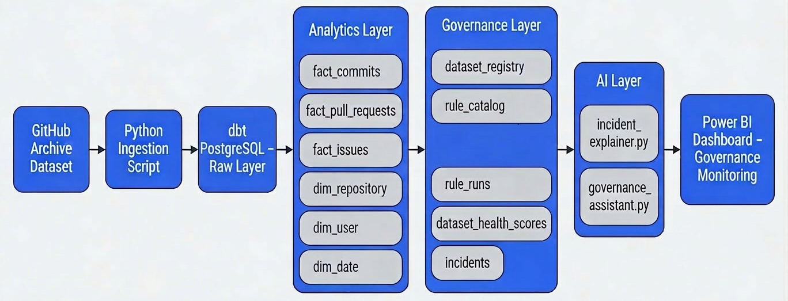
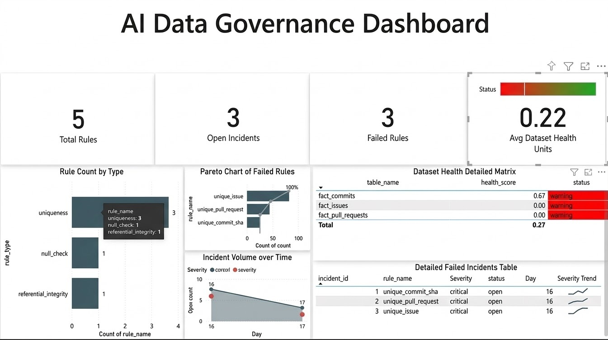

# AI Data Governance Platform

An end-to-end **data governance and data quality monitoring platform** built using PostgreSQL, dbt, Python, and Power BI.

The system ingests GitHub Archive events, models analytics datasets using dbt, executes automated data quality rules, detects governance incidents, calculates dataset health scores, and surfaces governance insights through a monitoring dashboard with AI-assisted explanations.

---

# Business Problem

Modern analytics platforms rely on many pipelines and datasets.  
Without governance controls, data quality issues can silently propagate and break downstream dashboards, ML models, and decision-making.

This project demonstrates how analytics teams can implement a **data governance layer** that:

- monitors dataset quality
- executes automated rule checks
- tracks incidents and failures
- calculates dataset health
- explains issues using AI

---

# Architecture

The system follows a layered data platform architecture.



### Data Flow


GitHub Archive Dataset
↓
Python Ingestion Pipeline
↓
PostgreSQL Raw Storage
↓
dbt Transformation Layer
↓
Analytics Layer (fact & dimension tables)
↓
Governance Engine (rules, incidents, health scoring)
↓
AI Explanation Layer
↓
Power BI Monitoring Dashboard


---

# Core Features

### Data Ingestion
Python pipeline ingests GitHub Archive event data into PostgreSQL.

### Analytics Modeling
dbt transforms raw events into structured analytics tables:

- `fact_commits`
- `fact_pull_requests`
- `fact_issues`
- `dim_repository`
- `dim_user`
- `dim_date`

### Governance Metadata Layer
Tracks datasets and quality rules.

Tables:

- `dataset_registry`
- `rule_catalog`
- `rule_runs`
- `dataset_health_scores`
- `incidents`

### Automated Rule Engine
A Python rule runner executes governance rules and logs failures.

Example rules include:

- duplicate commit detection
- null commit checks
- foreign key validation
- duplicate issue detection

### Dataset Health Scoring
Dataset health is computed based on rule failures:


health_score = 1 - (failed_rules / total_rules)


### Incident Detection
Failed rules automatically generate governance incidents.

### AI Incident Explanation
AI scripts generate explanations for rule failures to help teams understand data quality issues faster.

### Governance Monitoring Dashboard
Power BI dashboard visualizes:

- dataset health
- rule failures
- governance incidents
- reliability metrics



---

# Tech Stack

| Component | Technology |
|--------|-------------|
| Data Source | GitHub Archive |
| Ingestion | Python |
| Storage | PostgreSQL |
| Transformation | dbt |
| Governance Engine | Python + SQL |
| AI Layer | OpenAI API |
| Monitoring | Power BI |

---

# Project Structure

```text
ai-data-governance-platform
│
├── dashboard
│ └── governance_dashboard.png
│
├── docs
│ ├── architecture_diagram.png
│ ├── governance_architecture.md
│ ├── rule_dictionary.md
│ ├── scalability.md
│ └── incident_explanations
│
├── github_governance_dbt
│ ├── models
│ ├── macros
│ ├── seeds
│ └── dbt_project.yml
│
├── python
│ ├── ingest_github_archive.py
│ ├── rule_runner.py
│ ├── incident_explainer.py
│ ├── governance_assistant.py
│ └── rag_assistant.py
│
├── sql
│ └── governance_schema.sql
│
├── requirements.txt
└── README.md
```

---

# Example Governance Rule

Ensuring commit SHA uniqueness:


SELECT commit_sha
FROM mart_mart.fact_commits
GROUP BY commit_sha
HAVING COUNT(*) > 1


---

# Example Incident Output

When a rule fails, the system logs an incident:


incident_id | rule_id | severity | status | opened_at


This enables teams to track governance issues and prioritize fixes.

---

# Future Improvements

Potential enhancements:

- orchestration with Airflow or Dagster
- real-time anomaly detection
- Slack alerts for governance incidents
- integration with data catalogs
- RAG-based governance assistant

---

# License

This project is intended for educational and portfolio purposes.
